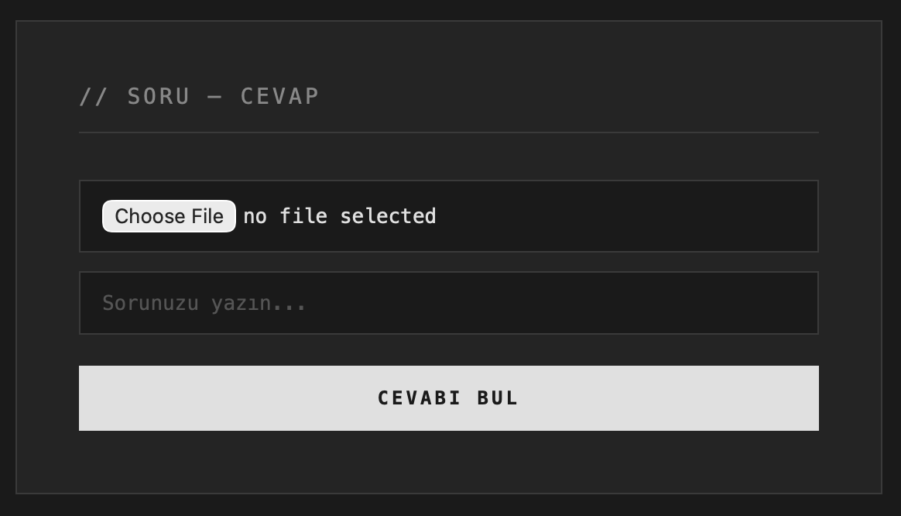

# Soru-Cevap Web Uygulaması



Yüklenen dosyalar (TXT, PDF, DOCX) üzerinde Türkçe soru-cevap yapabilen basit bir web uygulaması.

## Kullanılan Teknolojiler

- **Backend:** Flask
- **QA Modeli:** [savasy/bert-base-turkish-squad](https://huggingface.co/savasy/bert-base-turkish-squad)
- **Dosya İşleme:** PyPDF2, python-docx
- **Frontend:** HTML + CSS + JavaScript (vanilya)

## Kurulum

1. Repoyu klonla:
```bash
   git clone https://github.com/KULLANICI_ADIN/REPO_ADI.git
   cd REPO_ADI
```

2. Gerekli paketleri kur:
```bash
   pip install -r requirements.txt
```

3. Uygulamayı başlat:
```bash
   python app.py
```

4. Tarayıcıdan `http://127.0.0.1:5000` adresine git.

## Nasıl Çalışır?

1. Kullanıcı TXT/PDF/DOCX dosya yükler
2. Soru yazar
3. Backend dosyayı metne çevirir
4. BERT tabanlı QA modeli metin içinde cevabı arar
5. Güven skoru 0.1'in altındaysa "cevap bulunamadı" döner

## Notlar

- İlk çalıştırmada model (~400MB) Hugging Face'ten indirilir.
- BERT'in 512 token limiti vardır, uzun dosyalarda metnin başına yakın cevaplar daha iyi bulunur.
